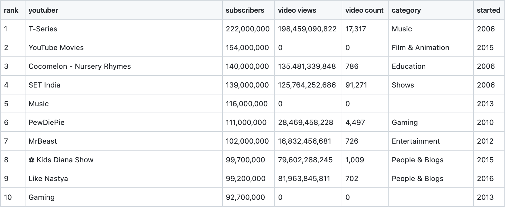
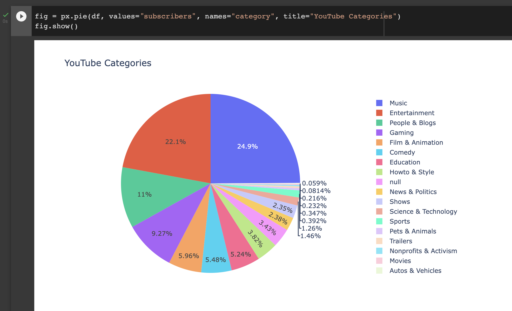
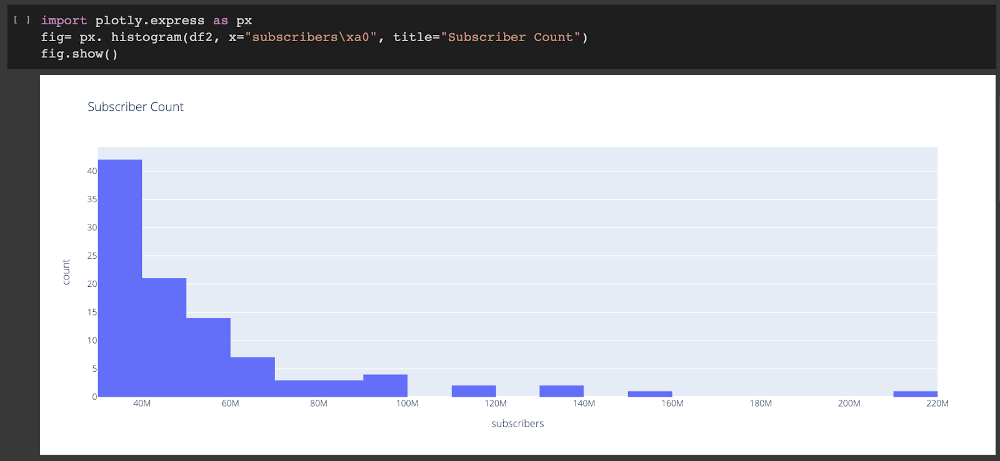
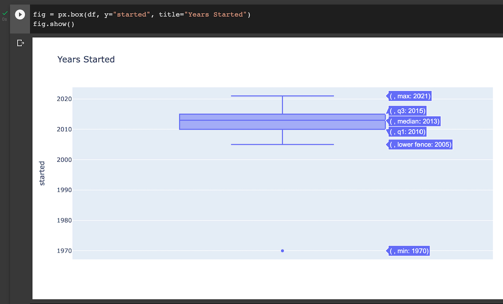

# Visualize YouTube Data

A comprehensive data visualization project analyzing the top YouTube channels using Python and various visualization libraries. This project explores subscriber counts, video views, channel categories, and more through interactive charts and statistical analysis.

## Description

This project analyzes the "Most Subscribed YouTube Channels" dataset from Kaggle, containing data about the top 1000 YouTube channels. The analysis includes data exploration, statistical insights, and multiple visualization techniques to understand YouTube channel performance patterns.

## Dataset

The dataset contains the following columns:

- **rank**: Rank of the channel as per total subscribers (1-1000)
- **youtuber**: Channel name
- **subscribers**: Total number of followers
- **video views**: Total views of all the videos combined
- **video count**: Number of videos uploaded
- **category**: Channel genre
- **started**: The year that the channel started

**Dataset Source**: [Top YouTube Channels Data on Kaggle](https://www.kaggle.com/datasets/surajjha101/top-youtube-channels-data)



## Folder Structure

```
Visualize-YouTube-Data/
├── .gitignore
├── README.md
├── requirements.txt
├── dataset.csv
├── main.ipynb
├── venv/
└── images/
    ├── dataset-screenshot.png
    ├── box-plot.jpg
    ├── histogram.png
    └── pie-chart.png
```

## How to Run (Virtual Environment)

1. **Clone the repository**:

   ```bash
   git clone <repository-url>
   cd Visualize-YouTube-Data
   ```

2. **Create and activate virtual environment**:

   ```bash
   python -m venv venv
   source venv/bin/activate  # On Windows: venv\Scripts\activate
   ```

3. **Install dependencies**:

   ```bash
   pip install -r requirements.txt
   ```

4. **Launch Jupyter Notebook**:

   ```bash
   jupyter notebook main.ipynb
   ```

5. **Run the analysis**: Execute all cells in the notebook to generate visualizations and insights.

## Findings

The analysis reveals insights about YouTube channel performance, including:

- Distribution of subscribers across different categories
- Relationship between video count and subscriber growth
- Temporal trends in channel creation
- Top-performing channels and their characteristics

## Visualizations

### Pie Chart - Channel Categories Distribution



### Histogram - Subscriber Distribution



### Box Plot - Statistical Analysis



## Technologies Used

- **Python 3.x**
- **Pandas** - Data manipulation and analysis
- **Matplotlib** - Basic plotting
- **Plotly** - Interactive visualizations
- **Jupyter Notebook** - Development environment
- **Kaleido** - Static image export for Plotly

## Author

**Misbah Ahmed Nauman**

- Portfolio: [MisbahAN.com](https://MisbahAN.com)

---

_This project demonstrates data analysis and visualization skills using real-world YouTube data to extract meaningful insights about content creator success patterns._
